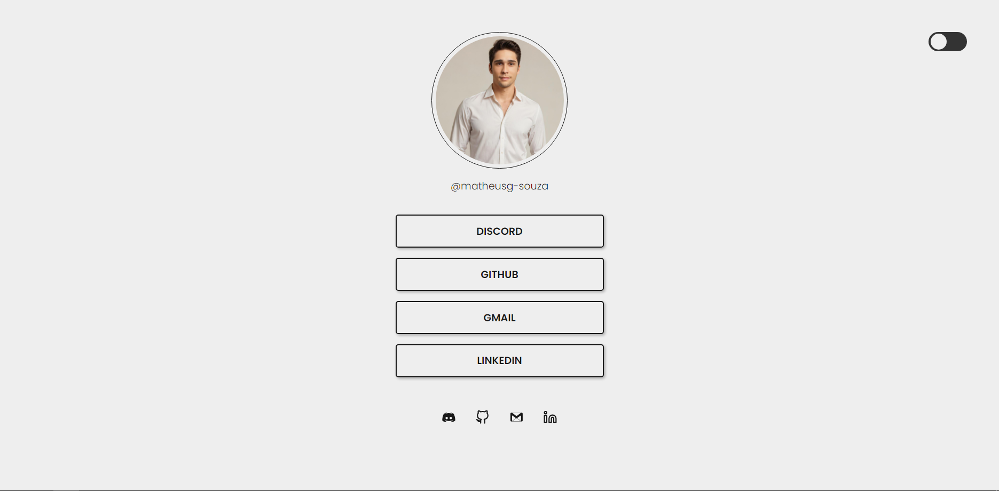

<h1 align="center"> Projeto Social Tree </h1>

Este é um projeto de uma lista de links que podem ser usadas em perfis de redes sociais.

  

## Tecnologias utilizadas
---
- HTML
- CSS
- Git e Github

##  Créditos
---
### 🚀 Desafios [rocketseat](https://efficient-sloth-d85.notion.site/b0b109c64d0a4a8eb4de547de18fa04d?v=dd9d2f6b0f6542d69807f41312f4116d)  **Social Tree**.

